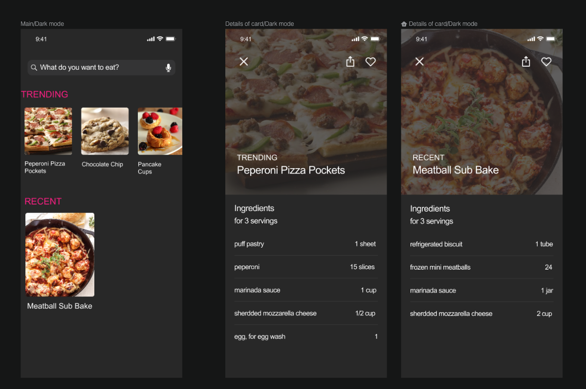

# Recetario de Cocina App

Photo by <a href="https://unsplash.com/@michaelwb?utm_source=unsplash&amp;utm_medium=referral&amp;utm_content=creditCopyText">Michael Browning</a> on <a href="https://unsplash.com/s/photos/cook?utm_source=unsplash&amp;utm_medium=referral&amp;utm_content=creditCopyText">Unsplash</a>

## Pre-requisitos
-  React Native
  - Instalar el entorno de desarrollo [**:warning: utiliza la opción React Native CLI Quickstart NO utilizar Expo**](https://reactnative.dev/docs/environment-setup)
- Editor de texto
  - Elegir un editor para codificar, puede ser [Visual Studio Code](https://code.visualstudio.com/), o algúno similar.
  - Agregar la extensión [Prettier](https://marketplace.visualstudio.com/items?itemName=esbenp.prettier-vscode) para mantener un estilo consistente en tu código
  - Instalar [ESLint](https://eslint.org/) para ayudarte a encontrar y arreglar problemas de tu código
  - Agregar la extensión [Eslint](https://marketplace.visualstudio.com/items?itemName=dbaeumer.vscode-eslint) integrar la funcionalidad de Eslint
- Calidad de código. Para analizar la calidad de tu código necesitarás
  - Instalar y configurar [DeepScan](https://deepscan.io/) para analizar tu codigo y mejorar la calidad atendiendo los resultados del análisis
  - Instalar y configurar [CodeFactor](https://www.codefactor.io/) para analizar tu codigo y mejorar la calidad atendiendo los resultados del análisis
  
## Requerimientos funcionales
  
  La empresa Foo Corp necesita una App para poder visualizar las recetas de cocina de sus restaurantes. La App deberá cumplir con los siguientes requerimientos:
  
- Pantalla principal 
  - Listado con las recetas que están de moda (trending)
  - Listado con las recetas más recientes 
  - Por cada receta se debe mostrar una foto del platillo de la receta y el nombre de la receta
- Pantalla detalle
  - Foto del platillo de la receta
  - Categoría de la receta (trending/recent)
  - Nombre de la receta
  - Porciones por receta (servings)
  - Listado de ingredientes con nombre y cantidad
  - Botón "me gusta" que servirá para etiquetar a las recetas favoritas
   
## Requerimientos no-funcionales
- Base de datos
  - Los datos (recetas) se tomarán de un archivo local en formato JSON 
- Calidad
  - Utilizar un estilo de código estandarizado (revisado por Eslint)
  - Puntuación **Good** obtenida en DeepScan
  - Puntuación **A** obtenida en CodeFactor
- Ejecución 
  - Puede ejecutarse en Android o iOs
- Código fuente
  - Orientado a Objetos
  - Métodos pequeños
  - Aplicar los principios [SOLID](https://blog.usejournal.com/how-to-apply-solid-principles-in-react-applications-6c964091a982)
  
## Diseño

En la carpeta [img](/img) se encuentra el diseño solicitado en formato PNG y Sketch.

## Tecnologías
- Lenguaje de programación React Native (CLI **no utilizar Expo**)

## Entregable
- [ ] Código fuente en Github
- [ ] Incluir en el repositorio la puntuación obtenida (badge) en DeepScan
- [ ] Incluir en el repositorio la puntuación obtenida (badge) en CodeFactor
- [ ] Documentar en [este archivo](setup/README.md) los pasos necesarios para ejecutar la App
- [ ] [Los commits deben se significativos](https://medium.com/better-programming/you-need-meaningful-commit-messages-d869e44e98d4)

## Evaluación
- [ ] Cumplimiento de requerimientos funcionales
- [ ] Cumplimiento de requerimientos no funcionales
- [ ] Implementacón del diseño solicitado

## Setup
[Aquí se describen los pasos necesarios para ejecutar y probar este proyecto](setup/README.md)

## Recursos
- [React Native Documentation](https://reactnative.dev/)
- [The Complete React Native and Redux Course](https://www.udemy.com/course/the-complete-react-native-and-redux-course/)
- [React Native: Advanced Concepts](https://www.udemy.com/course/react-native-advanced/)
- [Jest](https://jestjs.io/)
- [Detox](https://github.com/wix/Detox)
- [DeepScan](https://deepscan.io/)
- [CodeFactor](https://www.codefactor.io/)

